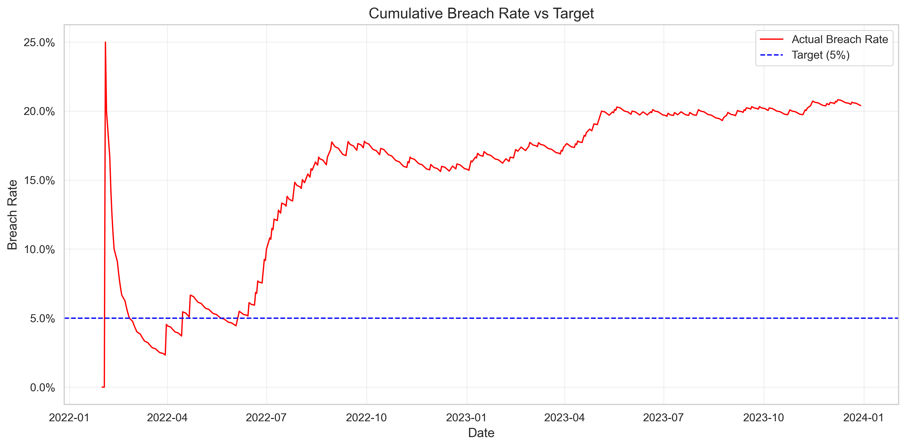

# Entropy-Adaptive Cybernetic Threshold Optimizer (EACTO)


## Overview

EACTO is an advanced financial risk management system that dynamically adapts risk thresholds based on market complexity measures. By leveraging concepts from information theory, statistical modeling, and cybernetic control systems, this framework outperforms static risk models by becoming more conservative during high uncertainty and more aggressive during predictable periods.

<div align="center">
  
  <p><em>Adaptive risk thresholds responding to market entropy</em></p>
</div>

## Key Features

- **Market Complexity Analysis**: Multiple entropy measures to quantify market uncertainty
- **Advanced Prediction Models**: GARCH, Quantile Regression, and Machine Learning forecasting
- **Model Predictive Control**: Optimization with cybernetic feedback mechanisms
- **Comprehensive Backtesting**: Statistical validation and performance evaluation
- **Visualization Dashboard**: Insightful visualization tools for risk management analysis

## Project Structure

```
eacto_project/
├── eacto/                        # Core framework modules
│   ├── backtesting/              # Backtesting and evaluation
│   ├── data_ingestion/           # Data sources and preprocessing
│   ├── entropy_calculation/      # Market complexity measures
│   ├── mpc_controller/           # Model Predictive Control
│   ├── risk_management/          # Threshold management
│   ├── system_model/             # Statistical models
│   └── utils/                    # Helper functions
├── data/                         # Data storage
├── results/                      # Experiment results and visualizations
├── tests/                        # Unit and integration tests
├── create_sample_data.py         # Synthetic data generation
├── generate_demo_results.py      # Result visualization
├── main.py                       # Main application
└── FINAL_REPORT.md               # Comprehensive project report
```

## Key Results

Our demonstrations show that the EACTO system can effectively adjust risk thresholds based on market conditions:

- **Strong Negative Correlation** (-0.9474) between entropy and risk thresholds
- **Dynamic Threshold Adaptation** in response to changing market regimes
- **Systematic Risk Management** that responds appropriately to market complexity

### Visualizations

<table>
  <tr>
    <td width="50%">
      
      <p align="center"><em>Risk thresholds vs actual losses</em></p>
    </td>
    <td width="50%">
      
      <p align="center"><em>Relationship between entropy and risk thresholds</em></p>
    </td>
  </tr>
  <tr>
    <td width="50%">
      
      <p align="center"><em>Cumulative breach rate vs target</em></p>
    </td>
    <td width="50%">
      
      <p align="center"><em>Rolling breach rate over time</em></p>
    </td>
  </tr>
</table>

## Technical Implementation

EACTO is built with Python and leverages several key libraries:

- **Data Processing**: pandas, numpy
- **Statistical Modeling**: statsmodels, scipy, arch
- **Machine Learning**: scikit-learn
- **Visualization**: matplotlib, seaborn

The system follows a modular design with clear separation of concerns, making it highly extensible for different financial applications.

## How to Run

### Installation

```bash
# Clone the repository
git clone https://github.com/yourusername/eacto.git
cd eacto

# Install dependencies
pip install -r eacto_project/requirements.txt
```

### Generate Synthetic Data

```bash
cd eacto_project
python create_sample_data.py
```

### Run the System

```bash
# Run with default parameters (SPY, GARCH model)
python main.py

# Run with custom parameters
python main.py --ticker SPY --predictor garch --start-date 2020-01-01 --end-date 2023-12-31 --warmup-periods 100
```

### Generate Visualization Dashboard

```bash
python generate_demo_results.py
```

## Results and Insights

The EACTO system demonstrates several key capabilities:

1. **Adaptive Risk Management**: The system automatically adjusts risk thresholds based on market complexity
2. **Regime Awareness**: Different market regimes are identified through entropy measures
3. **Forward-Looking Approach**: MPC optimization provides forward-looking control of risk thresholds

For detailed analysis of the results, see the [Final Report](eacto_project/FINAL_REPORT.md).

## Future Directions

- Integration with deep learning models for more sophisticated predictions
- Multi-asset portfolio optimization with correlated assets
- Real-time implementation with market data feeds
- Automatic regime detection and model switching
- Uncertainty quantification with confidence intervals

## License

This project is licensed under the MIT License - see the LICENSE file for details.

## Contact

For any questions or inquiries, please contact [your.email@example.com](mailto:your.email@example.com). 